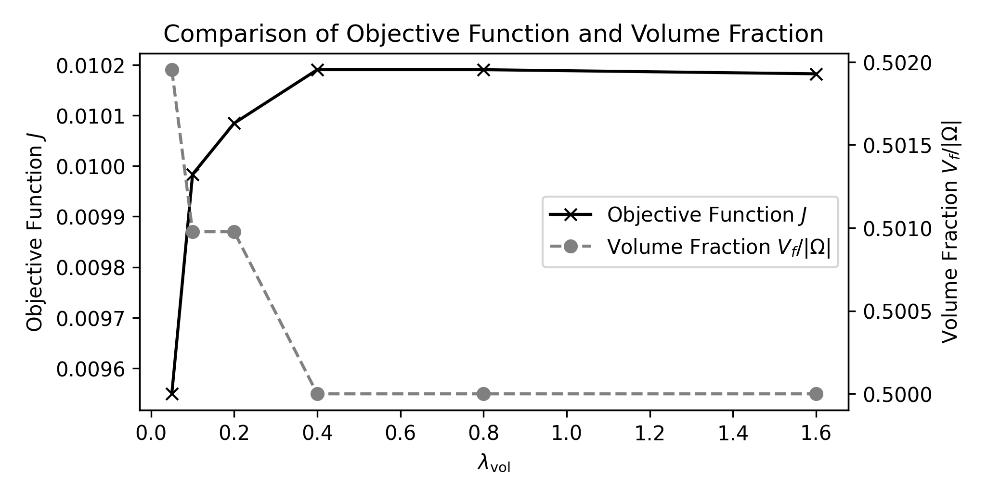
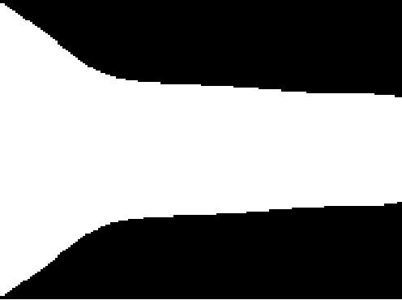
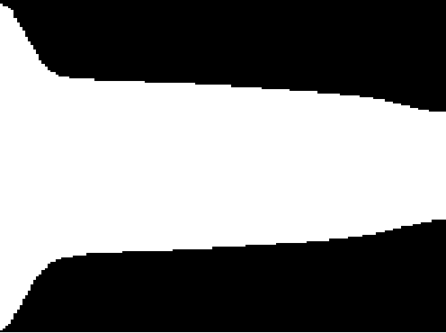

# Results Added in the Revised Manuscript
## Study of the Objective Function in the QUBO Problem
### Volume Constraint
Script: [diffuser_volume_constraint.py](diffuser/volume_constraint/diffuser_volume_constraint.py)

## Comparison with a Classical Optimization Approach
### Diffuser
#### Mesh Refinement Study
Script: [diffuser_comparison_mesh_refinement.py](diffuser/comparison/mesh_refinement/diffuser_comparison_mesh_refinement.py)

<table>
  <tr>
    <th></th>
    <th>32×32</th>
    <th>64×64</th>
    <th>96×96</th>
    <th>128×128</th>
    <th>160×160</th>
  </tr>
  <tr>
    <td><b>Classical</b></td>
    <td></td>
    <td></td>
    <td></td>
    <td></td>
    <td></td>
  </tr>
  <tr>
    <td><b>Annealing</b></td>
    <td></td>
    <td></td>
    <td></td>
    <td></td>
    <td></td>
  </tr>
</table>

